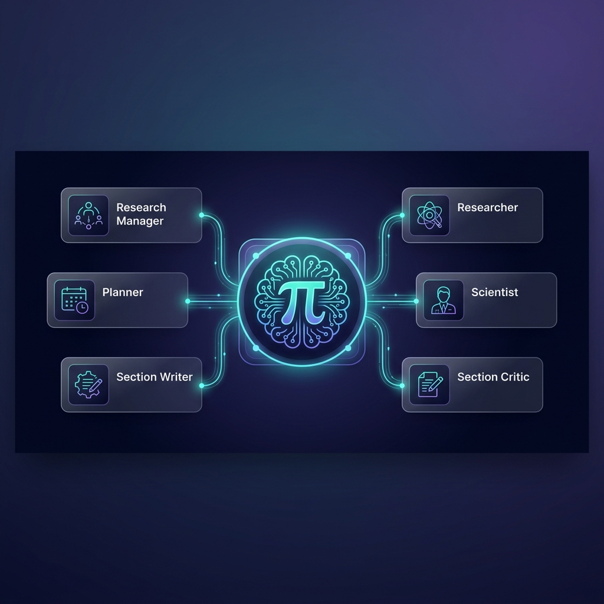
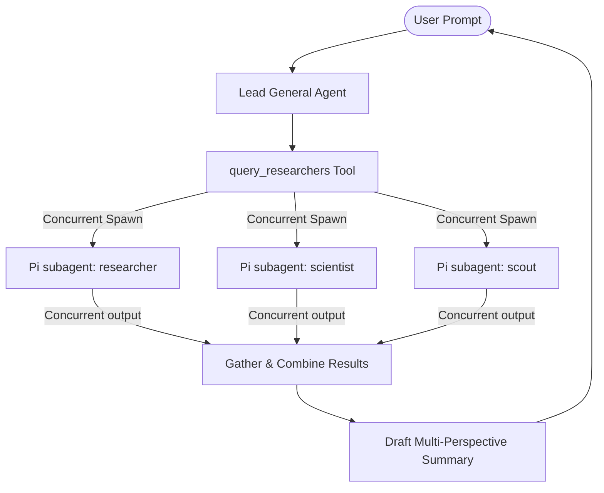
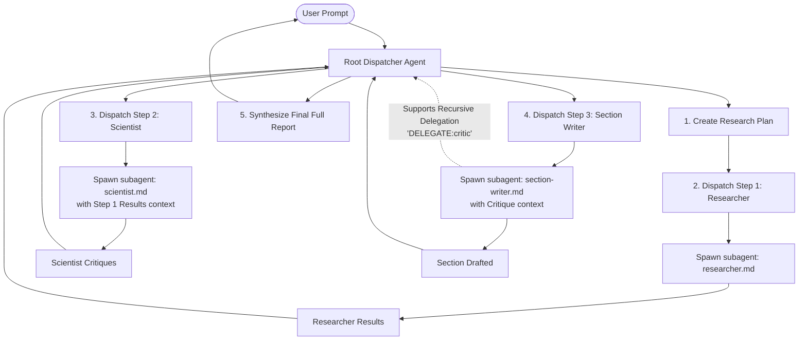

# pi-research-team



`pi-research-team` is a multi-agent system designed for conducting academic and technical research within the **Pi Coding Agent** framework. It orchestrates a specialized team of expert agents (Planner, Researcher, Scientist, Section Writer, Section Critic, and Research Manager) to streamline literature reviews, data extraction, analysis, draft development, and final report generation.

---

## 🚀 Installation & Running Options

By default, all extensions in this repository are **disabled on standard `pi` startups** to keep your standard runs fast and lightweight. You can use this package via one of the two options below:

### Option 1: Global Installation (Via `pi install`)
This is the recommended way for most users as it allows Pi to manage dependencies, updates, and global availability.

1. **Install the package globally**:
   ```bash
   pi install git:github.com/mbenetti/pi-research-team.git
   ```

2. **Run extensions explicitly**:
   You can invoke any extension on-demand without editing any configurations by referencing its global user location:
   ```bash
   # Multi-Agent Sequential Dispatcher (Deep Research)
   pi -e ~/.pi/agent/git/github.com/mbenetti/pi-research-team/extensions/research-team.ts

   # Parallel Team TUI (General Research)
   pi -e ~/.pi/agent/git/github.com/mbenetti/pi-research-team/extensions/research-tui.ts

   # Visual Activity Tree
   pi -e ~/.pi/agent/git/github.com/mbenetti/pi-research-team/extensions/research-tree.ts
   ```

3. **Create Shell Aliases (Recommended for Convenience)**:
   To avoid typing the long paths every time, you can add aliases to your shell configuration file (e.g., `~/.zshrc` or `~/.bashrc`):
   ```bash
   # Add these to your ~/.zshrc or ~/.bashrc
   alias pi-research-team='pi -e ~/.pi/agent/git/github.com/mbenetti/pi-research-team/extensions/research-team.ts'
   alias pi-research-tui='pi -e ~/.pi/agent/git/github.com/mbenetti/pi-research-team/extensions/research-tui.ts'
   alias pi-research-tree='pi -e ~/.pi/agent/git/github.com/mbenetti/pi-research-team/extensions/research-tree.ts'
   ```
   After saving, reload your shell (`source ~/.zshrc` or `source ~/.bashrc`). Now you can run any of the tools from anywhere with simple commands:
   ```bash
   pi-research-team "Conduct a multi-step research on solid-state battery limitations"
   pi-research-tui "Ask the researcher to lookup the history of quantum physics"
   pi-research-tree "Visualize the activity tree"
   ```

4. **Enable Extensions Permanently (Optional)**:
   If you want some of these extensions to load automatically with every standard `pi` execution, run the interactive configuration:
   ```bash
   pi config
   ```
   Navigate the interactive menus to toggle and permanently load the `research-team`, `research-tree`, or `research-tui` extensions.

---

### Option 2: Local Installation (For Developers)
Use this option if you want to inspect, customize, or contribute to the extensions directly.

1. **Clone the repository and enter the directory**:
   ```bash
   git clone https://github.com/mbenetti/pi-research-team.git
   cd pi-research-team
   ```

2. **Install local dependencies**:
   ```bash
   npm install
   ```

3. **Run local extensions explicitly**:
   Invoke the extensions relative to your current working directory:
   ```bash
   # Sequential Orchestrator
   pi -e extensions/research-team.ts

   # Parallel Dashboard
   pi -e extensions/research-tui.ts

   # Tree Visualizer
   pi -e extensions/research-tree.ts
   ```

---

## 🧠 Architectural Workflows: Sequential vs. Parallel

At first glance, `research-team.ts` and `research-tui.ts` render similar-looking interactive TUI grids. However, they represent **entirely different multi-agent coordination paradigms**:

| Feature / Detail | `pi -e research-team` (Sequential Chaining Model) | `pi -e research-tui` (Parallel Leader Model) |
| :--- | :--- | :--- |
| **Primary Agent Role** | **Dispatcher Only.** The root agent has *zero* codebase tools. It acts as a pure coordinator, delegating everything. | **Active General.** The root agent acts as a lead author/compiler, retaining standard workspace files and terminal tools. |
| **Execution Flow** | **Sequential / Dependency-Chained.** Spawns one agent at a time, reviews its output, and pipes it to the next agent. | **Parallel / Concurrent.** Spawns and executes multiple specialist agents *simultaneously* in parallel. |
| **Primary Tool** | `dispatch_agent` (invokes a single agent for a specific step) | `query_researchers` (concurrently runs queries across multiple sub-agents) |
| **Recursive Delegation** | **Supported.** Sub-agents can run their own sub-dispatches recursively using `[DELEGATE:scientist]` blocks. | **Not Supported.** Execution returns directly to the leader agent; no nested/recursive delegation. |
| **Tools Lock** | Locks down session tools exclusively to `dispatch_agent` for safety. | Standard shell tools are fully available to the lead agent. |
| **Commands** | `/agents-team` (switch active team)<br>`/agents-list` (list states)<br>`/agents-grid N` (set grid columns) | `/team <name>` (load custom team)<br>`/researchers` (status table)<br>`/research-grid N` (set columns) |

---

## 📈 Choosing the Right Mode for Your Query

### Use **`pi -e research-tui`** for General Research 🔍
* **Ideal for**: Broader topics, rapid information retrieval, comparing opinions, and quick multi-perspective summaries.
* **Why it fits**: It optimizes for **speed and breadth**. Assigning tasks linearly is slow; compiling parallel answers is fast.

#### 📊 Parallel Workflow Diagram


* **How to test it**:
  Assign parallel research topics to the team in a single go:
  ```bash
  # Using the alias (recommended):
  pi-research-tui "Ask the researcher to lookup the history of quantum physics, and the scientist to draft physical definitions of gravity"

  # Or using the local path:
  pi -e extensions/research-tui.ts "Ask the researcher to lookup the history of quantum physics, and the scientist to draft physical definitions of gravity"
  ```
  *Visual Behavior*: You will see both the **Researcher** and **Scientist** cards instantly light up with a `◉ researching` status concurrently. Their results are gathered in parallel and delivered together.

---

### Use **`pi -e research-team`** for Deep Research 🧬
* **Ideal for**: Complex multi-stage workflows, formal literature reviews, writing deep papers, critical proofing, and recursive editing.
* **Why it fits**: Rigorous research has **hard dependencies**. You cannot criticize a research methodology until the searcher has found and downloaded the source papers.

#### 📊 Sequential Chaining Workflow Diagram


* **How to test it**:
  Assign a chained, multi-stage task:
  ```bash
  # Using the alias (recommended):
  pi-research-team "Conduct a multi-step research on solid-state battery limitations, write a draft of the report, and then deeply criticize it"

  # Or using the local path:
  pi -e extensions/research-team.ts "Conduct a multi-step research on solid-state battery limitations, write a draft of the report, and then deeply criticize it"
  ```
  *Visual Behavior*: The primary agent will draft a sequential plan. First, the **Researcher** card will highlight as it gathers data. Once finished, its results are piped to the **Scientist** (who analyzes them), then to the **Section-Writer** (who writes), and finally the **Critic** is dispatched sequentially to evaluate the outputs.

---

## 🛠️ Package Updates (v1.0.0)

* **Official `@earendil-works` Scope**: All core imports and `package.json` peer dependencies have been successfully migrated from the deprecated `@mariozechner` scopes to official packages.
* **0 Vulnerabilities**: All package version mismatches and high/moderate security weaknesses have been completely patched.
* **Lightweight Standard Execution**: By default, no resource-heavy dashboards load when you run a standard `pi` task, preventing terminal overhead until explicitly requested with the `-e` flag.
